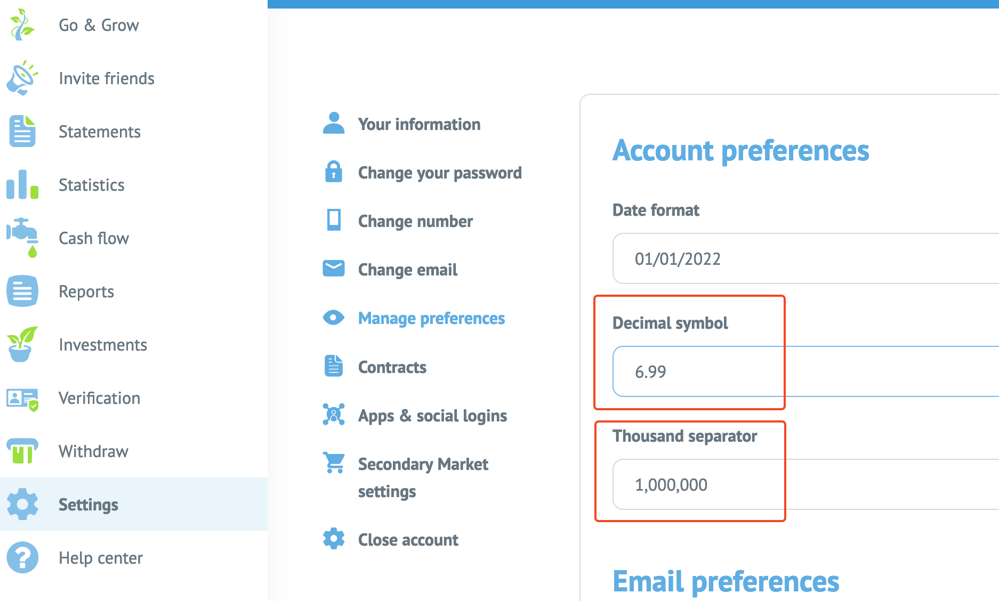

# moneymoney-bondora
MoneyMoney extension for Bondora

### Installation

Copy this extension to your MoneyMoney's extensions folder (default: `~/Library/Containers/com.moneymoney-app.retail/Data/Library/Application Support/MoneyMoney/Extensions`).

**Note**: If you clone this project, the extension won't be signed and will only work if you're running a beta version of `MoneyMoney` and have disabled the checking of signatures (`Preferences -> Extensions -> Untick check box`).

You can find a signed version either on
* the [release page](https://github.com/EmDee/moneymoney-bondora/releases), or
* [MoneyMoney's extensions page](https://moneymoney-app.com/extensions/Bondora.lua)

**Note**: This extension will only work with `MoneyMoney` version `2.3.7` or newer.

### Usage

Simply add a new account and select `Bondora Account` in the `Others` category. Enter your login credentials and you're good to go.

The extension will work for `Bondora's Go & Grow`, I haven't tested it for the other Bondora products.

### Limitation

This extension will only work, if your English preferences for decimal and thousand separator are following the default setting:

